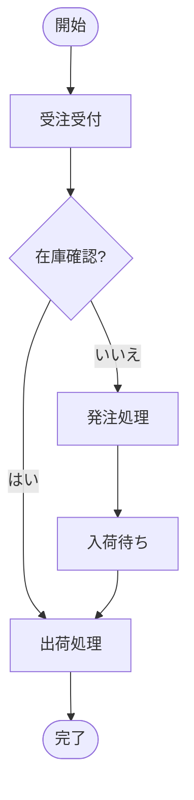

# 設計書

## アーキテクチャ概要

既存のパイプラインアーキテクチャと並列に「図形変換パイプライン」を追加する。
セルデータ変換パイプラインには一切手を加えない（独立した拡張）。

```
xlsx ファイル
  │
  ├─── 既存パイプライン ──→ list[RawCell] → TextBlock → DocElement → Markdown
  │
  └─── 図形変換パイプライン（新規）
         │
         ▼
       ZipFile で xl/drawings/drawing*.xml を直接パース
         │
         ▼
       DiagramShape / DiagramConnector（新規dataclass, models.py に追加）
         │
         ▼
       MermaidRenderer（新規: renderer/mermaid_renderer.py）
         │
         ▼
       ```mermaid\n...\n``` （Markdown埋め込みコードブロック）
```

## コンポーネント設計

### 1. サンプルXLSX生成スクリプト（`tests/e2e/fixtures/make_sample_flowchart.py`）

**責務**:
- DrawingML XMLを直接組み立てて、フローチャートを含むxlsxを生成
- openpyxlでセルデータ（タイトル等）を設定し、drawings XMLは手動で注入

**実装の要点**:
- openpyxlはシェイプ追加APIを持たないため、xlsxのZIPを直接操作
- `xl/drawings/drawing1.xml` にDrawingML XML（形状・コネクタ）を書く
- `xl/worksheets/_rels/sheet1.xml.rels` にdrawingのrelを追加
- `[Content_Types].xml` に drawing の ContentType を追加
- 位置はセル座標（行・列 + オフセット）ではなくEMU（English Metric Unit）で指定
  - 1 inch = 914400 EMU、1 cm ≈ 360000 EMU
- 作成するフローチャートシナリオ（受注処理フロー）:
  ```
  [開始] → [受注受付] → {在庫確認?} → はい → [出荷処理] → [完了]
                                     ↓ いいえ
                                  [発注処理] → [入荷待ち] → [出荷処理]
  ```

**DrawingML XML構造**:
```xml
<xdr:wsDr xmlns:xdr="...">
  <!-- 図形: TwoCellAnchor で位置指定 -->
  <xdr:twoCellAnchor>
    <xdr:from><xdr:col>1</xdr:col>...</xdr:from>
    <xdr:to>...</xdr:to>
    <xdr:sp>
      <xdr:nvSpPr>
        <xdr:cNvPr id="2" name="開始"/>
      </xdr:nvSpPr>
      <xdr:spPr>
        <a:prstGeom prst="flowChartTerminator"/>
      </xdr:spPr>
      <xdr:txBody><a:p><a:r><a:t>開始</a:t></a:r></a:p></xdr:txBody>
    </xdr:sp>
    <xdr:clientData/>
  </xdr:twoCellAnchor>

  <!-- コネクタ -->
  <xdr:twoCellAnchor>
    ...
    <xdr:cxnSp>
      <xdr:nvCxnSpPr>
        <xdr:cNvPr id="10" name="コネクタ 1"/>
        <xdr:cNvCxnSpPr>
          <a:stCxn id="2" idx="3"/>   <!-- 始点: shape id=2, connection point idx=3 (bottom) -->
          <a:endCxn id="3" idx="1"/>  <!-- 終点: shape id=3, connection point idx=1 (top) -->
        </xdr:cNvCxnSpPr>
      </xdr:nvCxnSpPr>
      ...
    </xdr:cxnSp>
  </xdr:twoCellAnchor>
</xdr:wsDr>
```

### 2. 新規データモデル（`models.py` に追加）

```python
@dataclass(frozen=True)
class DiagramShape:
    shape_id: int           # cNvPr id
    name: str               # cNvPr name
    text: str               # txBody のテキスト（空白除去済み）
    shape_type: str         # prstGeom の prst 値（例: "flowChartProcess"）
    left_col: int           # TwoCellAnchor.from_.col（0-based）
    top_row: int            # TwoCellAnchor.from_.row（0-based）
    right_col: int          # TwoCellAnchor.to_.col（0-based）
    bottom_row: int         # TwoCellAnchor.to_.row（0-based）

@dataclass(frozen=True)
class DiagramConnector:
    connector_id: int       # cNvPr id
    name: str               # cNvPr name
    start_shape_id: int | None   # stCxn id（Noneは未接続）
    end_shape_id: int | None     # endCxn id（Noneは未接続）
    label: str              # コネクタ上のテキストラベル（あれば）
```

### 3. DrawingML抽出モジュール（`excel_to_markdown/drawing/extractor.py`）

**責務**:
- xlsxファイルをZipFileとして開き `xl/drawings/drawing*.xml` を検索
- ElementTreeでパースし、DiagramShape / DiagramConnector を抽出

**名前空間**:
```python
NS = {
    "xdr": "http://schemas.openxmlformats.org/drawingml/2006/spreadsheetDrawing",
    "a":   "http://schemas.openxmlformats.org/drawingml/2006/main",
    "r":   "http://schemas.openxmlformats.org/officeDocument/2006/relationships",
}
```

**主要関数**:
```python
def extract_diagrams(xlsx_path: Path) -> list[tuple[list[DiagramShape], list[DiagramConnector]]]:
    """xlsxの全シートから図形・コネクタを抽出。シートごとにタプルを返す。"""
```

**抽出ロジック**:
1. ZipFileで `xl/drawings/` 以下のXMLファイルを列挙
2. 各XMLの `<xdr:twoCellAnchor>` / `<xdr:oneCellAnchor>` をイテレート
3. `<xdr:sp>` → DiagramShape（`nvSpPr/cNvPr[@id]`・`spPr/prstGeom[@prst]`・txBody）
4. `<xdr:cxnSp>` → DiagramConnector（`nvCxnSpPr/cNvCxnSpPr/stCxn[@id]`・`endCxn[@id]`）

### 4. Mermaidレンダラー（`excel_to_markdown/renderer/mermaid_renderer.py`）

**責務**:
- DiagramShape / DiagramConnector リストをMermaid flowchart文字列に変換

**形状→Mermaidノード種別マッピング**:
```python
SHAPE_TO_MERMAID = {
    "flowChartTerminator": "([{text}])",   # スタジアム形
    "flowChartProcess":    "[{text}]",      # 四角
    "rect":                "[{text}]",
    "flowChartDecision":   "{{{text}}}",    # ひし形（Mermaidでは{{ }}）
    "diamond":             "{{{text}}}",
    "ellipse":             "(({text}))",    # 楕円
    "flowChartConnector":  "(({text}))",
    # その他: デフォルト四角
}
```

**グラフ方向判定**:
- 全Shapeのbounding boxを計算
- 縦幅 > 横幅 × 1.2 → `TD`（Top Down）
- それ以外 → `LR`（Left Right）

**出力形式**:
```

```

### 5. CLIへの統合（`cli.py`）

**責務**:
- `--diagram` フラグを追加
- 指定時は図形変換パイプラインを実行してMermaid出力

## データフロー

### 図形変換パイプライン
```
1. Path(xlsx_path) を受け取る
2. ZipFile として開いて xl/drawings/drawing*.xml を抽出
3. ElementTree でパース
4. TwoCellAnchor / OneCellAnchor をイテレート
5. sp → DiagramShape、cxnSp → DiagramConnector に変換
6. MermaidRenderer で flowchart 文字列生成
7. Markdownコードブロックとして出力
```

## エラーハンドリング戦略

- drawing XMLが存在しない場合: 空リストを返す（エラーなし）
- prstGeomが未知の形状タイプ: デフォルト四角でフォールバック
- stCxn/endCxnが未設定のコネクタ: エッジなしでスキップ

## テスト戦略

### ユニットテスト
- `tests/test_drawing_extractor.py`: サンプルxlsxからの抽出テスト
- `tests/test_mermaid_renderer.py`: DiagramShape/Connector → Mermaid文字列テスト

### 統合テスト
- サンプルxlsx → 期待Mermaid文字列のゴールデンファイル比較

## 依存ライブラリ

追加依存なし。すべて標準ライブラリ（zipfile, xml.etree.ElementTree）で実装。

## ディレクトリ構造

```
excel_to_markdown/
├── drawing/                        # 新規ディレクトリ
│   ├── __init__.py
│   └── extractor.py                # DrawingML → DiagramShape/Connector
├── renderer/
│   ├── markdown_renderer.py        # 既存（変更なし）
│   └── mermaid_renderer.py         # 新規
├── models.py                       # DiagramShape/Connector を追加
└── cli.py                          # --diagram フラグ追加

tests/
├── test_drawing_extractor.py       # 新規
├── test_mermaid_renderer.py        # 新規
└── e2e/fixtures/
    └── make_sample_flowchart.py    # 新規（サンプルxlsx生成スクリプト）
```

## 実装の順序

1. `models.py` に DiagramShape / DiagramConnector を追加
2. `tests/e2e/fixtures/make_sample_flowchart.py` でサンプルxlsxを生成・検証
3. `drawing/extractor.py` を実装
4. `tests/test_drawing_extractor.py` を実装
5. `renderer/mermaid_renderer.py` を実装
6. `tests/test_mermaid_renderer.py` を実装
7. `cli.py` に `--diagram` フラグを追加

## セキュリティ考慮事項

- XXE（XML External Entity）: `xml.etree.ElementTree` は外部エンティティを展開しないためデフォルトで安全

## パフォーマンス考慮事項

- drawing XMLは通常小さい（数KB〜数十KB）。ElementTreeで問題なし
