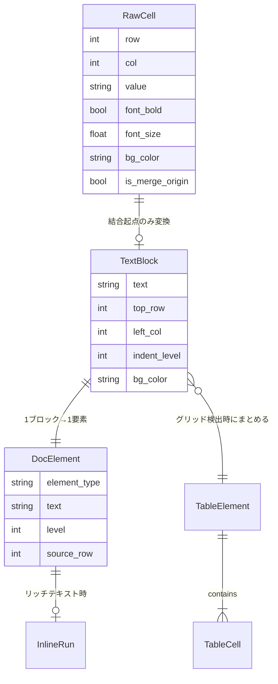
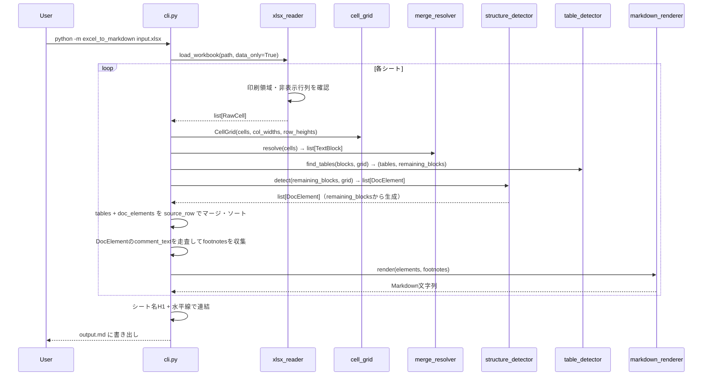
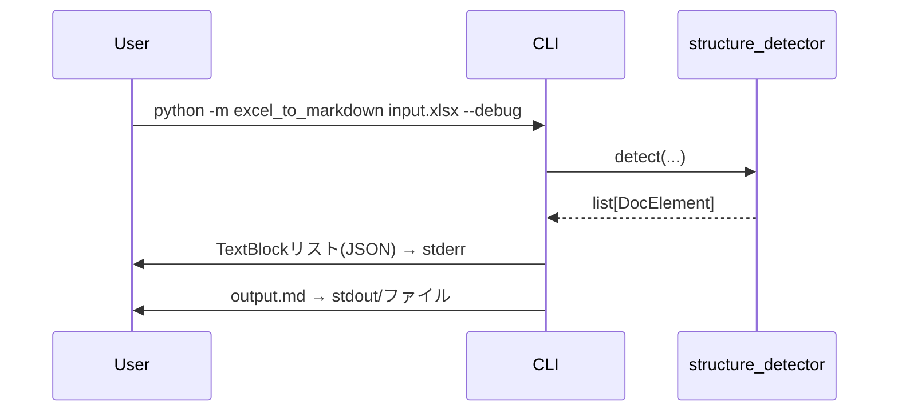

# 機能設計書 (Functional Design Document)

## システム構成図


### 変換パイプラインの5段階

```
[.xlsx/.xls] → [RawCell] → [TextBlock] → [DocElement] → [Markdown文字列]
               Reader      MergeResolver  StructureDetector  Renderer
```

---

## 技術スタック

| 分類 | 技術 | 選定理由 |
|------|------|----------|
| 言語 | Python 3.12 | 型ヒント・dataclassが成熟。標準ライブラリで十分 |
| xlsx読み込み | openpyxl 3.1+ | 純Pythonで結合セル・フォント情報を完全サポート |
| xls読み込み | xlrd 2.x (P1) | .xls専用。openpyxlと同じRawCellモデルに変換 |
| CLI | argparse（標準ライブラリ） | 追加依存なし。十分な機能を持つ |
| テスト | pytest 8.x | フィクスチャ管理が優れている |
| テストカバレッジ | pytest-cov | カバレッジ80%以上を計測 |

---

## データモデル定義

### レイヤー1: RawCell（生セルデータ）

```python
from dataclasses import dataclass

@dataclass(frozen=True)
class RawCell:
    row: int                        # 1-based 行番号 (openpyxl準拠)
    col: int                        # 1-based 列番号 (openpyxl準拠)
    value: str | None               # セルの文字列値（数値は文字列に変換済み）
    font_bold: bool                 # 太字フラグ
    font_italic: bool               # イタリックフラグ
    font_strikethrough: bool        # 取り消し線フラグ
    font_underline: bool            # 下線フラグ
    font_size: float | None         # フォントサイズ（pt）。未設定時はNone
    font_color: str | None          # 文字色 ARGB hex（例: "FF000000"）。テーマ色はNone
    bg_color: str | None            # 背景色 ARGB hex（例: "FFFFFFFF"）
    is_merge_origin: bool           # 結合セルの起点か否か
    merge_row_span: int             # 結合の行スパン（非結合・非起点は1）
    merge_col_span: int             # 結合の列スパン（非結合・非起点は1）
    has_comment: bool               # セルコメントの有無
    comment_text: str | None        # セルコメントのテキスト
```

**制約**:
- `is_merge_origin=False` かつ結合領域内のセルは `value=None` として扱い、変換対象から除外する
- `font_size=None` はExcelのデフォルトスタイル継承を意味する（見出し判定では「フォントサイズ条件を満たさない」として扱う）

---

### レイヤー2: TextBlock（テキストブロック）

```python
@dataclass
class TextBlock:
    text: str               # セルのテキスト内容（前後の空白を除去済み）
    top_row: int            # 先頭行 (1-based)
    left_col: int           # 先頭列 (1-based)
    bottom_row: int         # 末尾行 (1-based)
    right_col: int          # 末尾列 (1-based)
    row_span: int           # 行スパン
    col_span: int           # 列スパン
    font_bold: bool
    font_italic: bool
    font_strikethrough: bool
    font_underline: bool
    font_size: float | None
    bg_color: str | None    # 背景色 ARGB hex（セクション境界判定に使用）
    has_comment: bool
    comment_text: str | None
    indent_level: int       # 後処理で計算。左端列位置から算出したインデント階層
    inline_runs: list["InlineRun"] = field(default_factory=list)  # リッチテキスト分割（部分書式用）
```

```python
@dataclass(frozen=True)
class InlineRun:
    """セル内の部分書式適用テキスト。セル全体に書式がある場合はTextBlockに統合。"""
    text: str
    bold: bool = False
    italic: bool = False
    strikethrough: bool = False
    underline: bool = False
```

---

### レイヤー3: DocElement（文書要素）

```python
import enum

class ElementType(enum.Enum):
    HEADING    = "heading"
    PARAGRAPH  = "paragraph"
    LIST_ITEM  = "list_item"
    TABLE      = "table"
    BLANK      = "blank"

@dataclass
class DocElement:
    element_type: ElementType
    text: str               # HEADING/PARAGRAPH/LIST_ITEMのテキスト。TABLE/BLANKは空文字
    level: int              # HEADINGは1-6、LIST_ITEMはインデント深さ(1+)、その他は0
    source_row: int         # 元のExcel行番号（ソート・デバッグ用）
    is_numbered_list: bool = False  # 番号付きリスト（`1.`/`1)` 始まり）か否か
    comment_text: str | None = None # 脚注として出力するセルコメント

@dataclass
class TableCell:
    text: str
    row: int                # テーブル相対行インデックス (0-based)
    col: int                # テーブル相対列インデックス (0-based)
    is_header: bool         # 最初の行のセルはTrue
    # 注意: 表内の結合セルはセルスパンのMarkdown表現が未サポート。
    #       非起点セルは空文字("")として出力される（情報の欠落を抑制するためベストエフォート）。

@dataclass
class TableElement(DocElement):
    element_type: ElementType = field(default=ElementType.TABLE, init=False)
    rows: list[list[TableCell]] = field(default_factory=list)
    col_count: int = 0
```

---

### データフロー図（ER的表現）



---

## コンポーネント設計

### 0. models.py — 共有データモデル

**責務**: パイプライン全体で使用するデータ構造を一元定義する

**配置クラス**: `RawCell`, `TextBlock`, `InlineRun`, `DocElement`, `TableElement`, `TableCell`, `ElementType`

**依存関係**:
- 依存可能: Python標準ライブラリのみ（`dataclasses`, `enum`）
- 依存禁止: openpyxl, xlrd, パッケージ内の他モジュール（循環依存防止）

全レイヤー（reader/, parser/, renderer/）がこのモジュールを参照する共有レイヤー。

---

### 1. cli.py / __main__.py — CLIレイヤー

**責務**: コマンドライン引数のパース・バリデーション、変換パイプラインの起動

**`__main__.py`**: `python -m excel_to_markdown` のエントリーポイント。`cli.py` の `main()` を呼び出すのみで、ロジックは持たない。

```python
def parse_args(argv: list[str] | None = None) -> argparse.Namespace:
    """CLI引数を解析する。バリデーションエラーはargparseが処理。"""
    ...

def run(args: argparse.Namespace) -> int:
    """
    変換パイプライン全体を実行し、exit codeを返す。

    複数シート統合ロジック:
    1. 全シートを順番に処理する（--sheet 指定時は1シートのみ）
    2. 各シートのMarkdown文字列を生成する
    3. シート数が2枚以上の場合: シート名を `# シート名\n\n---\n\n` で区切り1つに連結する
    4. 最終Markdown文字列を出力ファイルに書き出す
    """
    ...
```

**CLIオプション仕様**:

| オプション | 短縮 | デフォルト | 説明 |
|-----------|------|-----------|------|
| `input` | — | (必須) | 入力 .xlsx/.xls ファイルパス |
| `--output` | `-o` | 入力と同名.md | 出力 .md ファイルパス |
| `--sheet` | `-s` | (全シート) | シート名または0-basedインデックス（例: `0` = 1枚目） |
| `--base-font-size` | — | `11.0` | 見出し判定フォントサイズ閾値の基準値（pt） |
| `--debug` | — | False | TextBlockリストをJSON形式でstderrに出力 |
| `--version` | — | — | バージョンを表示して終了 |

---

### 2. reader/xlsx_reader.py — xlsx読み込み

**責務**: openpyxlを使ってシートからRawCellリストを抽出する

```python
def read_sheet(ws: Worksheet, print_area: str | None) -> list[RawCell]:
    """
    ワークシートからRawCellリストを返す。
    - 印刷領域が設定されている場合はその範囲内のみ処理
    - 非表示の行・列は除外
    - 結合セルの非起点セルはスキップ
    """
    ...

def extract_font_props(cell: Cell) -> tuple[bool, bool, bool, bool, float | None, str | None]:
    """セルのフォントプロパティ（bold, italic, strike, underline, size, color）を返す。
    テーマ色は解決せずNoneを返す。"""
    ...

def extract_bg_color(cell: Cell) -> str | None:
    """セルの背景色をARGB hexで返す。塗りつぶしなし・グラデーションはNoneを返す。"""
    ...

def get_print_area(ws: Worksheet) -> tuple[int, int, int, int] | None:
    """印刷領域を (min_row, min_col, max_row, max_col) で返す。未設定はNone。"""
    ...
```

**依存**: openpyxl

---

### 3. reader/xls_reader.py — xls読み込み（P1）

**責務**: xlrdを使ってシートからRawCellリストを抽出する（xlsx_readerと同一の出力型）

```python
def read_sheet_xls(sheet: xlrd.sheet.Sheet, wb: xlrd.Book) -> list[RawCell]:
    """xlrdシートからRawCellリストを返す。xlsx_readerと同一の出力型。"""
    ...
```

**依存**: xlrd 2.x

---

### 4. parser/cell_grid.py — 空間クエリ層

**責務**: RawCellリストから空間的な統計・クエリを提供する

```python
@dataclass
class CellGrid:
    cells: list[RawCell]
    col_widths: dict[int, float]    # 列番号 → 列幅（Excel文字幅単位: ws.column_dimensions[col].width で取得する値）
    row_heights: dict[int, float]   # 行番号 → 行高さ（Excelポイント単位: ws.row_dimensions[row].height で取得する値）

    @property
    def baseline_col(self) -> int:
        """コンテンツが存在する最左の列番号。"""
        ...

    @property
    def col_unit(self) -> float:
        """列幅の中央値（方眼紙のグリッドピッチの推定値）。"""
        ...

    @property
    def modal_row_height(self) -> float:
        """行高さの最頻値（方眼紙の行ピッチの推定値）。"""
        ...

    def is_empty_row(self, row: int) -> bool:
        """指定行にテキストを含むセルが存在しない場合Trueを返す。"""
        ...
```

---

### 5. parser/merge_resolver.py — TextBlock生成

**責務**: RawCellリストをTextBlockリストに変換する

```python
def resolve(cells: list[RawCell]) -> list[TextBlock]:
    """
    非空のRawCellをTextBlockに変換し、(top_row, left_col)でソートして返す。
    - 値がNoneまたは空白のみのセルはスキップ
    - リッチテキスト（部分書式）はInlineRunリストとして保持
    - indent_levelは0で初期化（後でstructure_detectorが更新）
    - セル内改行（\\n）はそのままtextに保持する（Markdown変換はrendererが担当）
    """
    ...

def to_inline_runs(cell: RawCell) -> list[InlineRun]:
    """openpyxlのリッチテキスト（_CellRichText）をInlineRunリストに変換する。"""
    ...
```

---

### 6. parser/table_detector.py — 表検出

**責務**: TextBlockリストからGFMテーブルに変換すべきグリッド領域を検出する

```python
def find_tables(
    blocks: list[TextBlock], grid: CellGrid
) -> tuple[list[TableElement], list[TextBlock]]:
    """
    グリッド状の配置を検出してTableElementに変換する。
    戻り値: (検出したTableElementリスト, 表に含まれなかったTextBlockリスト)

    検出条件:
    - 2行以上 × 2列以上の矩形
    - 各行の列境界（left_col）が一致している
    - 曖昧なケース（不完全グリッド）は検出しない（保守的）

    ヘッダーなし表の扱い:
    - 全行のフォント書式を比較し、1行目が bold かつ他行が非bold の場合 is_header=True
    - それ以外（ヘッダー行が判定できない場合）は全行 is_header=False とし、
      GFM出力時は1行目をヘッダー行として扱う（GFMはヘッダー行必須のため）
    """
    ...
```

---

### 7. parser/structure_detector.py — 文書構造検出（コアコンポーネント）

**責務**: TextBlockリストをDocElementリストに変換する

```python
def detect(
    blocks: list[TextBlock],
    grid: CellGrid,
    base_font_size: float = 11.0,
) -> list[DocElement]:
    """
    テーブルを除いたTextBlockをDocElementに変換する。
    注意: table_detectorの呼び出しはcli.pyが担当する。
    このメソッドは find_tables() 済みの remaining_blocks を受け取る。

    1. TextBlockにインデントレベルを付与（compute_indent_tiers使用）
    2. 各TextBlockを見出し/段落/リスト/ラベル:値に分類
    3. BLANK要素を挿入
    4. ソート済みDocElementリストを返す
    """
    ...

def compute_indent_tiers(blocks: list[TextBlock], grid: CellGrid) -> dict[int, int]:
    """
    全TextBlockのleft_colを収集し、col_unit * 1.5以内の列を同一ティアにグループ化する。
    戻り値: {left_col → indent_level} のマッピング
    """
    ...

def classify_heading(block: TextBlock, base_font_size: float) -> int | None:
    """
    見出しレベル(1-6)を返す。見出しでない場合はNoneを返す。
    判定は優先順位順（PRD機能要件2参照）。
    """
    ...

def is_label_value_pair(left: TextBlock, right: TextBlock) -> bool:
    """
    同一行の2ブロックがラベル:値パターンか判定する。
    判定条件: left.textが20文字以下
    前提: top_rowが一致する2ブロックの組に対して呼び出すこと。
          行一致の確認は呼び出し元のprocess_row_group()が担当する。
    """
    ...
```

**見出し判定アルゴリズム（優先順位順）**:

| 優先度 | 条件 | 判定結果 |
|--------|------|---------|
| 1 | `font_size >= base_font_size * (18/11)` | H1 |
| 2 | `font_size >= base_font_size * (14/11)` かつ `font_bold` | H2 |
| 3 | `font_size >= base_font_size * (12/11)` かつ `font_bold` | H3 |
| 4 | `font_bold` かつ `indent_level == 0` | H4 |
| 5 | `font_bold` かつ `indent_level == 1` | H5 |
| 6 | `font_bold` かつ `indent_level >= 2` | H6 |
| — | 上記いずれにも該当しない | 見出しでない |

> **前提**: `font_size=None`（Excelのデフォルトスタイル継承）の場合、優先度1〜3のフォントサイズ条件はすべて不成立として扱う。太字フラグのみで判定する優先度4〜6は `font_size=None` でも適用される。

**空行挿入ルール**:

| 条件 | 挿入 |
|------|------|
| ブロック間の行ギャップ > `modal_row_height × 2` | BLANK要素を挿入 |
| 前ブロックと後ブロックの背景色が異なる | BLANK要素を挿入 |
| 前ブロックの背景色が白(`FFFFFFFF`)以外で後ブロックが白(`FFFFFFFF`)または`None` | BLANK要素を挿入 |

> **背景色の表記**: 本ドキュメントでは ARGB hex 形式（例: `FFFFFFFF`）を使用する。openpyxl の `bg_color` は `FF` + `RRGGBB` の8桁で返るため、白色の判定は `"FFFFFFFF"` との比較で行う。

---

### 8. renderer/markdown_renderer.py — Markdown生成

**責務**: DocElementリストをMarkdown文字列に変換する

```python
def render(elements: list[DocElement], footnotes: list[str]) -> str:
    """
    DocElementリストをMarkdown文字列に変換する。
    footnotes: 脚注テキストリスト（セルコメント）。
              呼び出し元(cli.py)がDocElementのcomment_textを走査して収集し渡す。
              脚注番号はrender_element()が[^1]から連番で付与する。
              末尾に[^1]: 内容 の形式で一括出力する。
    """
    ...

def render_element(el: DocElement, footnote_counter: int) -> tuple[str, int]:
    """1要素をMarkdown文字列に変換する。脚注付き要素は連番を更新して返す。"""
    ...

def render_inline(text: str, runs: list[InlineRun]) -> str:
    """テキストとInlineRunリストを結合してインライン書式付きMarkdown文字列を生成する。"""
    ...

def apply_inline_format(run: InlineRun) -> str:
    """InlineRunを対応するMarkdown記法に変換する。"""
    # bold → **text**, italic → *text*, strikethrough → ~~text~~, underline → <u>text</u>
    ...

def convert_cell_newlines(text: str) -> str:
    """セル内改行（\\n）をMarkdownハードブレーク（行末スペース2つ + \\n）に変換する。"""
    # 例: "1行目\n2行目" → "1行目  \n2行目"
    ...

def collapse_blank_lines(md: str) -> str:
    """3行以上の連続空行を2行に圧縮する。"""
    ...
```

**レンダリング仕様**:

| ElementType | level | 出力 |
|-------------|-------|------|
| HEADING | n | `"#" * n + " " + text + "\n\n"` |
| PARAGRAPH | 0 | `text + "\n\n"` |
| LIST_ITEM | 1 | `"- " + text + "\n"` |
| LIST_ITEM | 2 | `"  - " + text + "\n"` |
| LIST_ITEM | n | `"  " * (n-1) + "- " + text + "\n"` |
| TABLE | — | GFMテーブル形式 |
| BLANK | — | `"\n"` |

**セル内改行変換**: テキスト中の `\n`（Alt+Enter で入力した改行）は Markdown ハードブレーク（行末スペース2つ + `\n`）に変換する。`convert_cell_newlines()` がすべての要素テキストに適用する。

**GFMテーブル出力例**:
```markdown
| 列1 | 列2 | 列3 |
| --- | --- | --- |
| データ1 | データ2 | データ3 |
```

---

## ユースケース図

### 基本変換フロー（全シート変換）



### --debug オプション使用時



---

## アルゴリズム設計

### インデントレベル計算

**目的**: セルの列位置からインデント階層を算出する（方眼紙の位置ズレを許容）

```python
def compute_indent_tiers(blocks: list[TextBlock], grid: CellGrid) -> dict[int, int]:
    """
    col_unit × 1.5 以内の列を同一ティアにグループ化する。

    例: col_unit=3, cols=[2, 3, 6, 7, 10] の場合
        tier0: [2, 3] (差=1 ≤ 4.5)
        tier1: [6, 7] (差=1 ≤ 4.5)
        tier2: [10]
    戻り値: {2: 0, 3: 0, 6: 1, 7: 1, 10: 2}
    """
    sorted_cols = sorted(set(b.left_col for b in blocks))
    tiers: dict[int, int] = {}
    tier = 0
    tiers[sorted_cols[0]] = 0
    for i in range(1, len(sorted_cols)):
        if sorted_cols[i] - sorted_cols[i-1] > grid.col_unit * 1.5:
            tier += 1
        tiers[sorted_cols[i]] = tier
    return tiers
```

---

### ラベル:値パターン認識

**目的**: 同一行に横並びの2ブロックをラベルと値として認識する

```python
def group_same_row_blocks(blocks: list[TextBlock]) -> list[list[TextBlock]]:
    """同一 top_row のブロックをグループ化する。"""
    ...

def process_row_group(row_blocks: list[TextBlock]) -> list[DocElement]:
    """
    2ブロックかつ左ブロックが20文字以下 → ラベル:値パターン
    3ブロック以上 → スペース区切りで1段落に結合
    1ブロック → 通常の分類（見出し/段落/リスト）
    """
    ...
```

**変換例**:
```
入力: TextBlock("氏名:", col=2), TextBlock("山田太郎", col=10)
出力: DocElement(PARAGRAPH, text="**氏名:** 山田太郎")
```

---

### 表検出アルゴリズム

**目的**: 矩形グリッドを形成するTextBlockを検出してTableElementに変換する

```
ステップ1: 全TextBlockをrow→colの2次元マップに変換
ステップ2: 各ブロックを起点として矩形拡張を試みる
ステップ3: 候補矩形に対して列境界一致性を検証
           - 全行で同一の left_col セットを持つか確認
ステップ4: 最大の有効矩形を選択（貪欲法）
ステップ5: 検出した矩形に属するTextBlockを除外リストに追加
```

**保守的判定**: 列境界が完全一致しない矩形は表として検出しない。

---

## CLIインターフェース設計

```bash
usage: python -m excel_to_markdown [-h] [--output OUTPUT] [--sheet SHEET]
                                   [--base-font-size SIZE] [--debug] [--version]
                                   input

positional arguments:
  input                 変換する .xlsx または .xls ファイルのパス

options:
  -h, --help            使い方を表示して終了
  --output, -o OUTPUT   出力 .md ファイルパス（省略時: 入力と同名 .md）
  --sheet, -s SHEET     シート名または0-basedインデックス（省略時: 全シートを統合）
  --base-font-size SIZE 見出し判定の基準フォントサイズ（デフォルト: 11.0）
  --debug               TextBlockリストをJSON形式で stderr に出力
  --version             バージョンを表示して終了
```

**`--base-font-size` の動作**:
デフォルトの閾値（18pt/14pt/12pt）を `base_font_size / 11.0` 倍率で再計算する。
- `--base-font-size 10.5` → 閾値: 17.2pt / 13.4pt / 11.5pt

---

## エラーハンドリング

| エラー種別 | 発生条件 | 処理 | ユーザーへのメッセージ（stderr） |
|-----------|---------|------|-------------------------------|
| ファイル未存在 | 指定パスにファイルがない | exit code 1 | `エラー: ファイルが見つかりません: {path}` |
| 非対応形式 | .xlsx/.xls以外の拡張子 | exit code 1 | `エラー: 対応していないファイル形式です: {ext}（.xlsx/.xls のみ対応）` |
| パスワード保護 | openpyxlがファイルを開けない | exit code 1 | `エラー: パスワード保護されたファイルは変換できません` |
| シート未発見 | `-s` 指定のシートが存在しない | exit code 1 | `エラー: シートが見つかりません: {name}（存在するシート: {list}）` |
| 出力書き込み失敗 | 出力ファイルに書き込めない | exit code 1 | `エラー: 出力ファイルに書き込めません: {path}` |
| 空シート | 変換対象セルが0件 | 警告して継続 | `警告: シート "{name}" にコンテンツがありません。スキップします` |
| 構造認識不能 | 分類できないセル | ベストエフォート（継続） | Markdown内に `<!-- WARNING: 構造を認識できませんでした -->` を挿入 |
| 予期しない例外 | その他の例外 | exit code 2 | `予期しないエラーが発生しました: {message}` |

---

## テスト戦略

### ユニットテスト（モジュール別）

| テストファイル | 対象 | 主なテストケース |
|---------------|------|----------------|
| `test_xlsx_reader.py` | xlsx_reader | 結合セル起点/非起点の処理、フォント属性抽出、印刷領域フィルタリング、非表示行列の除外 |
| `test_cell_grid.py` | cell_grid | baseline_col、col_unit（中央値）、modal_row_height の計算 |
| `test_merge_resolver.py` | merge_resolver | 空白セルのスキップ、リッチテキストのInlineRun変換、ソート順序 |
| `test_table_detector.py` | table_detector | 2×2グリッド検出、不完全グリッドの非検出、表外ブロックへの影響なし |
| `test_structure_detector.py` | structure_detector | 見出し優先順位判定、インデントティア計算、ラベル:値パターン、空行挿入条件 |
| `test_markdown_renderer.py` | markdown_renderer | 各ElementTypeのMarkdown出力、GFMテーブル形式、脚注連番、空行圧縮 |

### 統合テスト（フィクスチャ→ゴールデン比較）

| フィクスチャ | テスト内容 |
|------------|----------|
| `simple_heading.xlsx` | 見出し+段落のシンプル文書 |
| `nested_list.xlsx` | 3段階ネストリスト |
| `label_value.xlsx` | ラベル:値パターン（2列・3列以上） |
| `mixed_document.xlsx` | 見出し・表・段落・リストが混在 |
| `with_comment.xlsx` | セルコメント付き（脚注変換） |
| `print_area.xlsx` | 印刷領域設定あり（領域外セルの除外） |

**テスト方法**: openpyxlでプログラム的にフィクスチャを生成し、変換結果を期待値（`.md` ゴールデンファイル）と文字列比較する。

### パフォーマンステスト

**計測環境**: CPU Core i5相当、メモリ8GB（`docs/architecture.md` のパフォーマンス要件参照）

```python
def test_performance_100rows():
    """A4縦1ページ相当（100行×50列）を3秒以内に変換できること。
    計測環境: CPU Core i5相当、メモリ8GB。
    計測方法: time.perf_counter() で計測し pytest 内でアサーション。
    """
    ...

def test_performance_1000rows():
    """1,000行×50列の方眼紙を30秒以内に変換できること。
    計測環境: CPU Core i5相当、メモリ8GB。
    計測方法: time.perf_counter() で計測し pytest 内でアサーション。
    """
    ...
```
