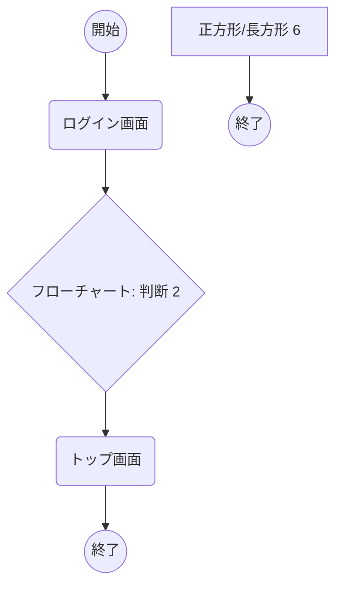

# 共通要件

個人ポートフォリオ分析システム 成果物名 章番 1 章名 共通要件

| 処理フロー | 節番 | 1 | 節名 | 対顧 | 作成日 | 2025-07-14 00:00:00 | 作成者 | 尾根田 |
| --- | --- | --- | --- | --- | --- | --- | --- | --- |
|  | 項番 | 1 | 項名 | 共通要件 | 変更日 |  | 変更者 |  |

### ■各画面の共通要件

| No | 内容 |
| --- | --- |
| 1 | 配色は赤を基調とする事 |
| 2 | Reactフレームワークを用いる事 |
| 3 | 美しいデザインとする事 |
| 4 | プロジェクトのフォルダ名はportfolio-systemフォルダを利用する事 |
| 5 | グラフの縦軸や、グラフ内に表示する残高のフォーマットは、¥1.5Mなどの表記ではなく¥1,500,000のフォーマットで日本に合わせた表記とする。 |

---

# 画面遷移

個人ポートフォリオ分析システム 成果物名 章番 1 章名 画面遷移フロー設計

| 処理フロー | 節番 | 1 | 節名 | 対顧 | 作成日 | 2025-07-14 00:00:00 | 作成者 | 尾根田 |
| --- | --- | --- | --- | --- | --- | --- | --- | --- |
|  | 項番 | 2 | 項名 | ログイン画面 | 変更日 |  | 変更者 |  |

以下に各画面の画面遷移フローを示す。

画面遷移フロー図

---

# トップ画面

個人ポートフォリオ分析システム 成果物名 章番 1 章名 画面

| 処理フロー | 節番 | 1 | 節名 | 対顧 | 作成日 | 2025-07-14 00:00:00 | 作成者 | 尾根田 |
| --- | --- | --- | --- | --- | --- | --- | --- | --- |
|  | 項番 | 3 | 項名 | ポートフォリオ表示画面 | 変更日 |  | 変更者 |  |

```mermaid
flowchart TD
    N4((円/楕円 3))
    N5[普通預金口座の残高]
    N9[定期預金口座の残高住宅財形]
    N16[NISA口座の残高S&P500]
    N18[特定口座の残高eMAXIS Slim 全世界株式（オール・カントリー）]
    N28[資産の内訳円グラフ]
    N35[正方形/長方形 34]
    N44[資産毎の残高棒グラフ]
    N46[ヘッダー]
    N47[入出金明細]
    N56[残高推移グラフ]
    N63[フッター]
    N2[店番の入力ボックス]
    N3[口座番号の入力ボックス]
    N6[読込ボタン]
    N8[科目のプルダウンメニュー]
    N10[各資産の合計金額を積み上げた線グラフをここに表示]
```

