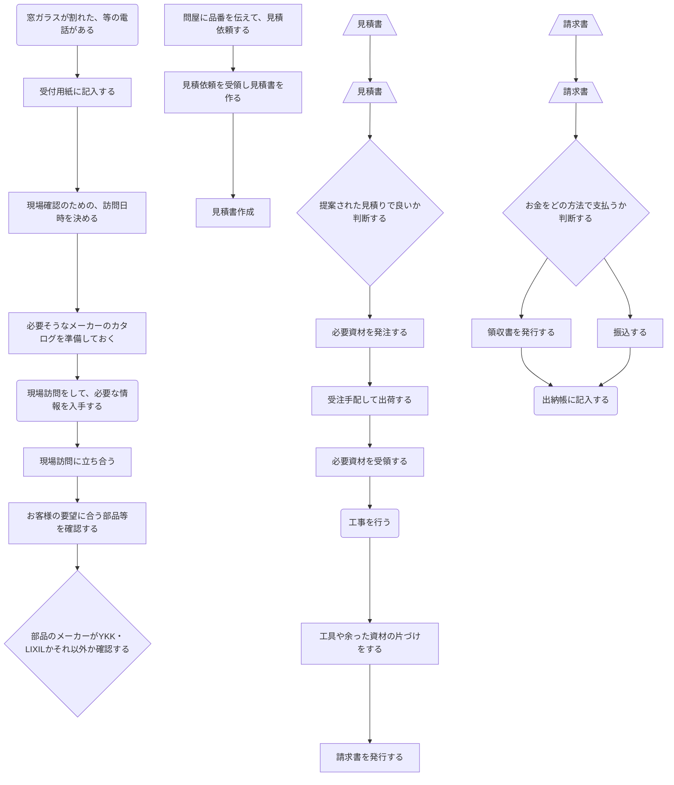

# はじめに

### 業務フローの作成

業務プロセスをフロー化するテンプレートです。

上側にあるボタンを押すと、それぞれに対応したボタンと、矢印が出てきます。

矢印はコネクタ線なので、それぞれのボックスとくっつけて下さい。

図形は、アクティブセルの”近く”に出てきます。

基本的に、図形を挿入するマクロが付いているだけで、あとは普通のエクセルです。

ベースとなるフォーマットは、自由に変更していただいて結構です。

（A3にするなり、横にするなり）

図形の色は、みなさんがお使いのエクセルの設定どおりになるんじゃないかと思います。

ボックスの大きさ、文字の大きさは変更できます。

変更したい場合は、元のブログ記事を見て下さいね。

[https://deskworklabo.jp/process-flow/](https://deskworklabo.jp/process-flow/)

---

# 単一業務

---

# 複数部署

