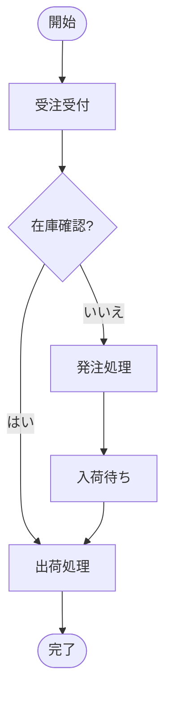

```mermaid
flowchart TD
    N2([開始])
    N3[受注受付]
    N4{在庫確認?}
    N5[出荷処理]
    N7([完了])
    N6[発注処理]
    N8[入荷待ち]
    N2 --> N3
    N3 --> N4
    N4 -->|はい| N5
    N4 -->|いいえ| N6
    N5 --> N7
    N6 --> N8
    N8 --> N5
```
